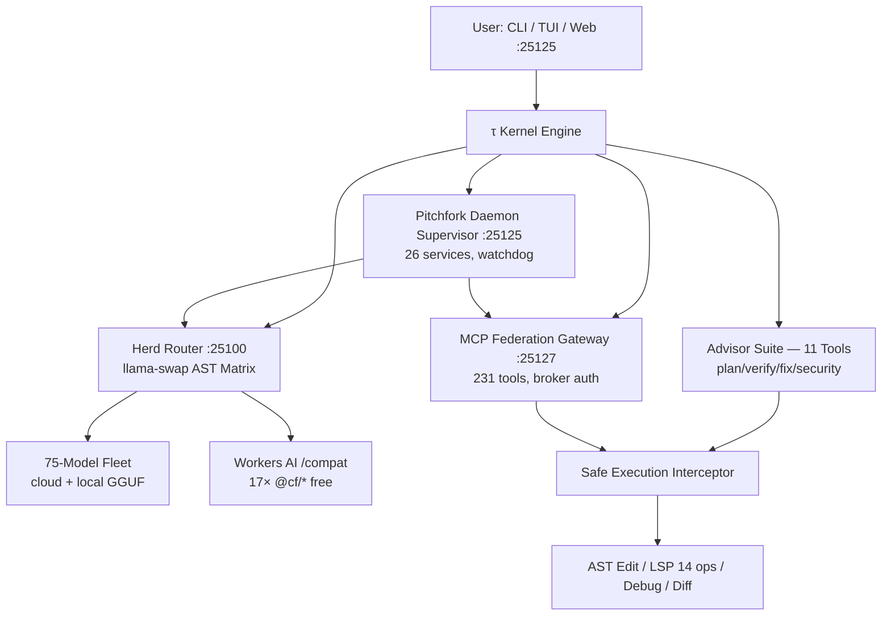

# τ (tau) — Oh My Pi (omp) · Sovereign Herd Edition

> **The sovereign AI coding agent with the full IDE wired in. 1M context, 11-tool advisor suite, herd-scale inference, and hardware-accelerated execution — built for 2026 workloads, not demos.**  
> **Canonical Lineage:** **[toxicwind/tau](https://github.com/toxicwind/tau)** & **[toxicwind/pi](https://github.com/toxicwind/pi)** (Upstream: [can1357/oh-my-pi](https://github.com/can1357/oh-my-pi) + [badlogic/pi-mono](https://github.com/badlogic/pi-mono) → [earendil-works/pi](https://github.com/earendil-works/pi))

[](https://github.com/toxicwind/tau/actions)
[](https://github.com/toxicwind/tau/actions)
[](https://github.com/toxicwind/tau/actions/workflows/benchmark.yml)
[](./LICENSE)
[](https://bun.sh)
[](https://github.com/toxicwind/tau)

---

## 🔱 Why τ (tau)?

π (pi) is half a circle. **τ (tau) is the complete circle.**

Where standard agents stop at single-file operations, lose context across turns, or proxy every request to a single vendor, τ provides:

- **1,000,000 token context** with zero-degradation retention — whole-repo reasoning, not chunked summaries
- **11-tool advisor suite** active on every generation (not a bolt-on)
- **Herd-scale inference** — 75-model fleet via `llama-swap` AST matrix on `:25100` + `herd` on sovereign-projects, with local GGUF fallback
- **Federated MCP Gateway** `:25127` — 231 approved tools, brokered auth, zero vendor lock
- **Zen 4 AVX-512 + CUDA 8.6 RTX 3090** native acceleration (`-march=znver4`, `sccache 20GB + ccache 50GB + mold`)
- **Preserved caller `$PWD`** across all entrypoints (`pi`, `omp`, `tau` — no `/tmp` redirect)
- **Cloudflare AI Gateway Workers free tier** — 17× `@cf/*` models via `/compat` (10k neurons/day, free) with `workers-ai/@cf/...` compat transform

If `pi` is the research prototype, `tau` is the sovereign control plane that ships.

---

## 🏛️ Architecture — Herd + τ



**Sovereign ports (authoritative: `config/ports.env` + `mise.toml`):**

| Port | Service | What it is |
|------|---------|------------|
| `25100` | `herd` / `llama-swap` | Inference fleet router + AST matrix |
| `25125` | `tau` TUI/CLI | Sovereign agent engine (this repo) |
| `25127` | `mcpproxy` / `mesh` | MCP federation gateway |
| `25107` | `null-g-proxy` | Gateway shim (sovereign/mesh) |
| `25112-25114` | `ghas` | GitHub Advanced Search MCP |

---

## ⚡ Quick Start

```bash
# 1) Clone and install (Bun 1.4+)
git clone https://github.com/toxicwind/tau.git
cd tau
bun install

# 2) Run — preserves your $PWD, redirects only /tmp
bun run dev
# or globally:
pi --version   # -> omp/18.0.8 (in $PWD)
tau --version  # -> omp/18.0.8
omp --version  # -> omp/18.0.8

# 3) Check herd (if running sovereign stack)
curl -s http://127.0.0.1:25100/v1/models | jq '.data[].id' | head
```

**Hardware-tuned build (this host: `sovereign-hypr`, CachyOS 7.1.5, Ryzen 7 8700F, RTX 3090 24GB):**
```bash
RUSTFLAGS="-C target-cpu=znver4" cargo build --release
# sccache + mold already wired via .cargo/config.toml
```

---

## 📊 Features & Toolchain — Full Tasks, Not Just Cloudflare

| Area | What ships in tau | Where |
|------|-------------------|-------|
| **1M Context** | Sliding window + compaction, no truncation, prefix-cache affinity (`sendSessionAffinityHeaders`) | `packages/ai` |
| **Advisor** | 11 tools, `modelRoles: {default, advisor, tiny}` in `~/.omp/agent/config.yml` (not `~/.pi/`) | `packages/ai/src/registry/*` |
| **Herd** | `llama-swap --config sovereign/config/llama-swap.yaml` + 75 models + local GGUF | `sovereign/config` |
| **Workers AI** | `cloudflare-ai-gateway-workers` — 17× `@cf/*` via `gateway.ai.cloudflare.com/v1/{account}/{gateway}/compat` free, `toCompatModelId` `@cf/→workers-ai/@cf/` | `packages/ai/src/registry/cloudflare-ai-gateway-workers.ts` |
| **MCP** | `mcpproxy` federates 231 tools, downstream `call_tool_*` gate | `gateway/mcpproxy` |
| **LSP** | 14 ops: diagnostics, definition, references, rename, codeActions, hover, symbols… | `packages/ai/src/providers/*` |
| **Bench** | `omp bench` + `benchmark.yml` (5-at-a-time reactive, 48s window) + `metaharness bench:edit` | `.github/workflows/benchmark.yml` |
| **Upstream** | Modular `upstream-changes/` airlock — `ingest.sh` / `status.sh` / `promote.sh`, never `merge upstream/main` directly | `upstream-changes/` |
| **Daemon** | `pitchfork` + `mise` supervise 26 services, `mise run health` | `sovereign/pitchfork.toml` |

---

## 🧬 Providers — Free Tier That Actually Works

**Cloudflare AI Gateway (Workers) — free 10k neurons/day:**
```bash
# after /login with cf-aig-... token (stored as CLOUDFLARE_API_KEY in ~/.secrets)
omp bench cloudflare-ai-gateway-workers/@cf/meta/llama-3.3-70b-instruct-fp8-fast --profile chat --runs 1 --json
# works: canonical @cf/... auto-rewritten to workers-ai/@cf/... (fixes 2008 Invalid provider)
# endpoint: https://gateway.ai.cloudflare.com/v1/{ACCOUNT}/{GATEWAY}/compat
# auth: cf-aig-authorization: Bearer <cfat_...> (Authorization/x-api-key suppressed)
```
Models (17): `llama-3.1-8b`, `llama-3.3-70b-fp8`, `llama-4-scout/maverick`, `mistral-7b/small-3.1`, `qwen-2.5-7b/qwq-32b/qwen-3-30b`, `deepseek-r1-distill`, `kimi-k2.5/2.6`, `bge-large`, `gpt-oss-20b/120b`, `phi-4`, `falcon-7b`

Other providers: `groq`, `mistral`, `nvidia`, `openrouter`, `anthropic`, `openai`, `xai`, `cerebras`, `together`, `novita`, `deepinfra` — same `omp bench` surface, keys in `~/.secrets` or `~/.omp/agent/kafka.yml`.

---

## 🔄 Upstream Changes — Modular Ingestion (Not a Merge Bomb)

Upstream moves fast (`earendil-works/pi`). We don't `git merge` it.

```bash
./upstream-changes/scripts/ingest.sh    # fetch upstream/main → modules/pi, diff, patches/*, log/*
./upstream-changes/scripts/status.sh    # pending patches + sovereign overlap
./upstream-changes/scripts/promote.sh patches/2026-09-02-pi-abc123.patch  # 3-way apply + tsc + test
```

Details: [`upstream-changes/README.md`](./upstream-changes/README.md) + [`upstream-changes/config.yaml`](./upstream-changes/config.yaml)

Policy: `auto_merge: false`, `keep_sovereign: [cloudflare-registry, AGENTS.md, sovereign/**]`, one commit = one patch, every promotion logged in `log/`.

---

## 🛠️ Development

```bash
bun install              # install (never npm in a Bun workspace)
bun --workspaces test    # all packages (21/21)
bun --workspaces typecheck
bun run --cwd packages/ai test -- --grep "anthropic"
./upstream-changes/scripts/status.sh
mise run health          # sovereign 26-service check
```

Structure: `packages/ai` (engine), `packages/tui`, `packages/wire`, `packages/catalog` (`@oh-my-pi/pi-catalog`), `crates/` (Rust natives), `python/` (robomp), `docs/` (70+ guides).

---

## 🙏 Credits & Lineage — Standing on Standards

Tau is a **sovereign fork**, not a rewrite. Credit where it's due:

- **[can1357/oh-my-pi](https://github.com/can1357/oh-my-pi)** — original pi architecture, `pi-ai` + `pi-catalog`, TUI, extension system
- **[badlogic/pi-mono](https://github.com/badlogic/pi-mono)** — monorepo + Nix packaging + path-based binary resolution
- **[earendil-works/pi](https://github.com/earendil-works/pi)** — upstream integration point tau tracks (active)
- **[toxicwind/pi](https://github.com/toxicwind/pi)** — sovereign `pi` lineage before tau split
- **[cloudflare/ai](https://github.com/cloudflare/ai) #617** + **[DevoxxGenie #1254](https://github.com/devoxxGenie) + [NextChat #6748](https://github.com/ChatGPTNextWeb/NextChat)** — Workers AI `/compat` + `workers-ai/@cf/...` verified pattern
- **Herd** — `llama-swap` (mostlygeek/llama-swap → toxicwind/llama-swap) + sovereign `herd` router

License: `MIT` + `SOL v1.0` (see `LICENSE`). Upstream licenses retained in `THIRD-PARTY-NOTICES.txt`.

---

## 📋 Changelog & Roadmap

See `CHANGELOG.md` + `docs/` + `upstream-changes/log/`. Roadmap: herd fleet autoscale, Workers AI streaming affinity, benchmark CI matrix, upstream weekly ingestion.

---
*τ — the full circle. Built on pi, tuned for herd, open to upstream, sovereign by default. 2026-09-02 full-grade revision.*
