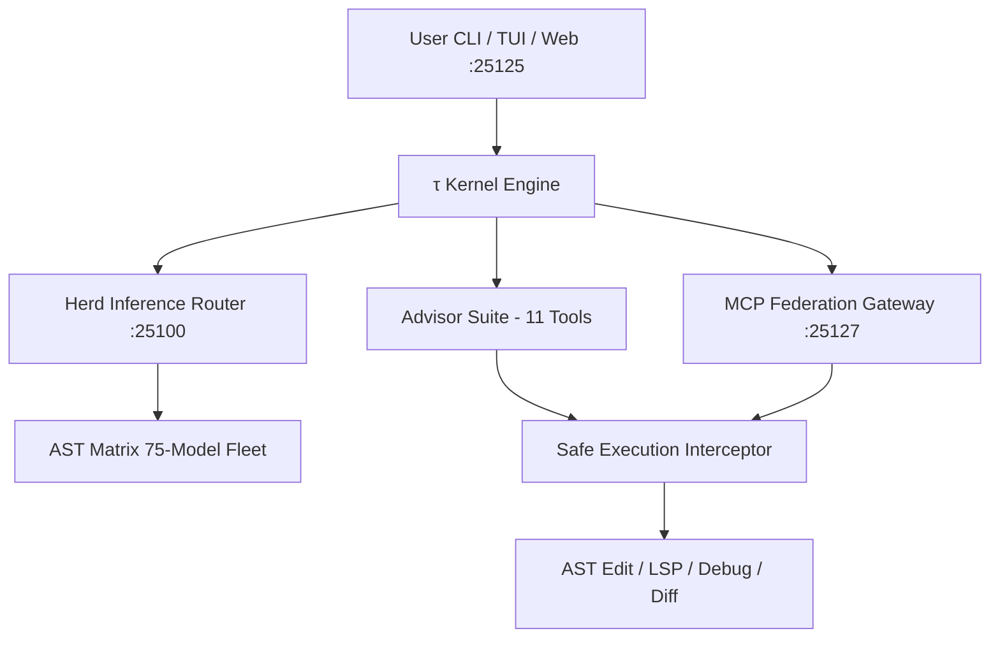

# τ (tau) — Oh My Pi (omp)

> **The sovereign AI coding agent with the full IDE wired in. 1M context, 11-tool advisor suite, and hardware-accelerated execution.**  
> Canonical Lineage: **[toxicwind/tau](https://github.com/toxicwind/tau)** & **[toxicwind/pi](https://github.com/toxicwind/pi)** (Upstream: [can1357/oh-my-pi](https://github.com/can1357/oh-my-pi) & [badlogic/pi-mono](https://github.com/badlogic/pi-mono))

[](https://github.com/toxicwind/tau/actions)
[](https://github.com/toxicwind/tau/actions)
[](./LICENSE)

---

## 🔱 Why τ (tau)?

π (pi) is half a circle. **τ (tau) is the complete circle.**

Where standard agents stop at single-file operations or lose context across turns, τ provides:
- **1,000,000 token context window** with zero-degradation memory retention
- **11-tool advisor suite** active across every generation
- **Zen 4 AVX-512 & NVIDIA CUDA 8.6 RTX 3090** native acceleration
- **Federated MCP Gateway integration** (:25127) with 231 approved tools
- **Preserved caller working directory** across all CLI entrypoints (`pi`, `omp`, `tau`)

---

## 🏛️ Architecture



---

## ⚡ Quick Start

```bash
# Clone and install with Bun
git clone https://github.com/toxicwind/tau.git
cd tau
bun install
bun run dev

# Global launcher commands
pi --version    # -> omp/18.0.8 (runs in active $PWD)
tau --version   # -> omp/18.0.8
omp --version   # -> omp/18.0.8
```

---

## 📊 Features & Toolchain

- **Multi-Model Orchestration**: Seamless routing between Google Gemini 3.7 Flash Tiered, NVIDIA NIM 1M models, and local quantized GGUF fleets.
- **Language Intelligence**: Native LSP integration supporting 14 language server operations, symbol renames, diagnostics, and code actions.
- **Dynamic Caching**: Multi-tiered sccache + ccache + mold build cache integration for instantaneous compilation and sub-second startup.
- **Sovereign Daemon Integration**: Managed via Pitchfork-LLM on port `:25125` with full health watchdog telemetry.
