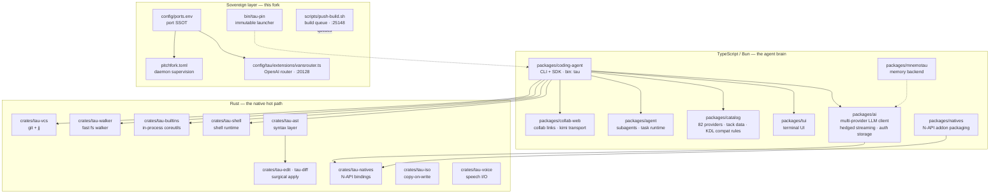

<div align="right">

[](https://github.com/toxicwind/tau)


</div>

# tau

> **τ — the Sovereign Ranch coding agent.** A terminal coding agent with the ranch wired in: an interactive CLI + SDK, a multi-provider LLM brain, a native Rust hot path, zero hardcoded ports, supervised daemons, and a source-owned model router.

<p align="center">
  
</p>

**What it is:** tau is a coding agent that lives in your terminal — `read`, `bash`, `edit`, `write` tools, session management, subagents, LSP-aware editing, a real debugger, web search, and GitHub integration. It speaks to 82 providers through a compiled model catalog with per-role model routing (provider wire data sourced from `@ranch/tack`, the ranch's single provider-data authority), and it does the fast work in-process through N-API native bindings instead of fork/exec.

**Why the fork exists:** upstream [tau](https://github.com/toxicwind/tau) gives you a coding agent. Tau gives you a **ranch** — an immutable pinned launcher that auto-update can't clobber, a single source of truth for ports (`config/ports.env`, zero hardcoded ports in code), pitchfork-supervised daemons, a source-owned OpenAI-compatible router (VansRouter on `:20128`), and a build queue that fires from a git hook.

**Who it's for:** Sovereign Ranch operators who want the agent wired into their own mesh — and anyone who runs tau and wants the ranch batteries.

---

## Features

- **Interactive CLI + SDK** — the `tau` package (`packages/coding-agent`) ships the `tau` binary (`src/cli.ts`) plus a programmatic SDK: "Coding agent CLI with read, bash, edit, write tools and session management."
- **Multi-provider LLM client** — `packages/ai` with role-based model routing: `smol`, `slow`, `plan`, `vision`, `task`, `advisor`, `tiny` (plus the base role); CLI flags `--smol`, `--slow`, `--plan`.
- **82 providers, tack-sourced catalog** — `packages/catalog` holds the provider census (`models.json`); provider wire data (base URLs, key env vars, auth schemes, `/models` adapters) comes from `@ranch/tack` (`ranch/tack`, projected onto the catalog shape by `packages/catalog/src/compat/tack.ts`), while KDL compat/auth rules (`src/compat/rules/**/*.kdl`) compile to `rules.json`; the fork's sovereign delta flips the NVIDIA default model to `openai/gpt-oss-20b`.
- **30+ documented tools** — one doc per tool under `docs/tools/`: `bash`, `read`, `write`, `edit`, `grep`, `glob`, `task`, `lsp`, `debug`, `browser`, `computer`, `web_search`, `github`, `tts`, `memory_edit`, `checkpoint`, `rewind`, `ask`, `learn`, `eval`, `ast-grep`, `ast-edit`, `security_scan`, `todo`, and more.
- **First-class subagents** — `task` fans out into isolated worktrees with typed results back (`packages/agent`).
- **Native hot path** — `crates/tau-natives` N-API bindings (prebuilt `pi_natives.linux-x64-{baseline,modern}.node` addons), `tau-shell` in-process shell runtime, `tau-builtins` (`grep`, `sed`, `cat`, `find`, `fd`, `rg`, `head`, `tail`, `tee`, `cut`, `date`, `ps`, `top`, `seq`, `yes`) — no fork/exec on the hot path.
- **AST-native editing** — `tau-ast` syntax layer with `tau-edit`/`tau-diff` surgical application; `ast-grep`/`ast-edit` tools.
- **Git + jj, native** — `crates/tau-vcs` drives both `git` and `jj` (diff, mutate, patch, read ops).
- **Copy-on-write file ops** — `crates/tau-iso` (`apfs.rs`, `linux_reflink.rs`, `windows_block_clone.rs`): reflinks where the filesystem allows.
- **Voice I/O** — `crates/tau-voice` for speech device handling.
- **Hedged streaming** — `packages/ai/src/utils/hedged-stream.ts`: if the leading request stalls past `hedgeStallMs`, a duplicate of the *same* request fires in parallel; first completion wins, losers abort. Never falls back to another model or provider. Kill switch: `PI_STREAM_HEDGE_ENABLED=0`.
- **Refactored auth storage** — `packages/ai/src/auth/`: OAuth refresh leases (`oauth-refresh-support.ts`), the credential storage contract (`storage-contract.ts`), a usage-metering cache (`usage-cache-impl.ts`), and usage metrics/ranking (`usage-metrics.ts`).
- **Collab links** — `packages/collab-web`: `/collab` → link + QR, join via `tau join` or browser, read-write or view-only; Kimi transport lets the UI drive Moonshot's `kimi-code` backend (`KIMI_TRANSPORT.md`).
- **No monkey patching, ever** — the Sovereign pre-release integration engine resolves hotfixes through `hotfixRegistry.resolve(target, default)` + `patches/*.ts` persistent overrides + `fs.watch` live reload (see `docs/PRE_RELEASE_INTEGRATION_ENGINE.md`).
- **VansRouter integration** — `config/tau/extensions/vansrouter.ts`: source-owned OpenAI-compatible router on `:20128`, canonical `.secrets` loading (`VANSROUTER_API_KEY` / `API_KEY_SECRET`), collapses `nvidia/nvidia/foo` → `nvidia/foo`.
- **Immutable binary pinning** — `bin/tau-pin` (→ `scripts/tau-pin`): hardened launcher that resolves the fork root via `git rev-parse --show-toplevel`, `realpath`-checks it stays inside, and refuses to fall through to PATH. Auto-update can't clobber it.
- **CI/CD push-building** — `scripts/push-build.sh`: git hook detects the toolchain (bun/rust/go/python), extracts the version, and queues `v18.3.0-<repo>-<sha>.json` to the buildsrv queue (`:25148`).
- **Port SSOT** — `config/ports.env`: `LLAMA_SWAP=25100`, `QDRANT=25133`, `KIMI_CODE=25126`, `VANSROUTER=20128`, `BUILDSRV=25148`, `FLOCK=25193`. Zero hardcoded ports in code.
- **Daemon supervision** — `pitchfork.toml`: `tau`, `mesh-hub`, `kimi-code`, `vansrouter`, `kimi-auto-shim`, `buildsrv` all pitchfork-tracked.

---

## Architecture


```mermaid
flowchart TB
    subgraph TS["TypeScript / Bun — the agent brain"]
        CLI["packages/coding-agent<br/>CLI + SDK · bin: tau"]
        AI["packages/ai<br/>multi-provider LLM client<br/>hedged streaming · auth storage"]
        TUI["packages/tui<br/>terminal UI"]
        CAT["packages/catalog<br/>82 providers · tack data · KDL compat rules"]
        TASK["packages/agent<br/>subagents · task runtime"]
        COLLAB["packages/collab-web<br/>collab links · kimi transport"]
        MEM["packages/mnemotau<br/>memory backend"]
        NATPKG["packages/natives<br/>N-API addon packaging"]
    end
    subgraph RS["Rust — the native hot path"]
        NAT["crates/tau-natives<br/>N-API bindings"]
        SH["crates/tau-shell<br/>shell runtime"]
        BI["crates/tau-builtins<br/>in-process coreutils"]
        WK["crates/tau-walker<br/>fast fs walker"]
        VCS["crates/tau-vcs<br/>git + jj"]
        AST["crates/tau-ast<br/>syntax layer"]
        ED["crates/tau-edit · tau-diff<br/>surgical apply"]
        ISO["crates/tau-iso<br/>copy-on-write"]
        VOI["crates/tau-voice<br/>speech I/O"]
    end
    subgraph SV["Sovereign layer — this fork"]
        VRO["config/tau/extensions/vansrouter.ts<br/>OpenAI router · :20128"]
        PORTS["config/ports.env<br/>port SSOT"]
        PF["pitchfork.toml<br/>daemon supervision"]
        PIN["bin/tau-pin<br/>immutable launcher"]
        PB["scripts/push-build.sh<br/>build queue · :25148"]
    end
    CLI --> AI
    CLI --> TUI
    CLI --> CAT
    CLI --> TASK
    CLI --> COLLAB
    AI --> NAT
    CLI --> SH
    CLI --> BI
    CLI --> WK
    CLI --> VCS
    NATPKG --> NAT
    MEM -.-> AI
    AST --> ED
    PORTS --> VRO
    PORTS --> PF
    PIN -.-> CLI
    PB -->|queues| SV
```

**Fork lineage (stated honestly):** tau is a fork/mirror of [can1357/tau](https://github.com/toxicwind/tau) with local changes. Fork point: upstream tag `v18.1.18` (2026-09-11). Upstream `v18.3.0` (`62bc57be1b03ef0802a33cf7f5f530e534527531`) was merged on 2026-09-24 — see [`FORK_MANIFEST.tsv`](./FORK_MANIFEST.tsv). The full sovereign delta is documented in [`MIRROR-DIFF-vs-upstream.md`](./MIRROR-DIFF-vs-upstream.md): +8,878/−4,669 lines across 398 changed paths at the fork point. Re-sync is diff-and-apply by hand (the tree was committed without upstream git history); the manual procedure lives in §8 of that doc. Permanent deliberate divergences: `crates/tau-builtins` ships no `bre.rs` (BRE handling is inlined into `grep.rs`/`sed.rs` — never copy upstream's versions verbatim), and the four-module auth split in `packages/ai/src/auth/` must be preserved across rebases.

| Layer | Crates / packages | What it owns |
| :--- | :--- | :--- |
| CLI + SDK | `packages/coding-agent` | `tau` binary, interactive mode, task runtime, tools |
| LLM client | `packages/ai` | providers, streaming, hedged-stream, auth, usage metering |
| TUI | `packages/tui` | differential terminal rendering |
| Catalog | `packages/catalog` | 82 providers; tack wire data + KDL rules → `rules.json` |
| Natives | `crates/tau-natives`, `packages/natives` | N-API bindings + prebuilt `.node` addons |
| Shell | `crates/tau-shell`, `crates/tau-builtins`, `crates/tau-walker` | shell runtime, in-process coreutils, fs walker |
| Edit | `crates/tau-ast`, `crates/tau-edit`, `crates/tau-diff` | syntax layer, surgical patch application |
| VCS | `crates/tau-vcs` | git + jj operations |
| Platform | `crates/tau-iso`, `crates/tau-voice` | copy-on-write, speech I/O |
| Ranch | `config/`, `scripts/`, `pitchfork.toml`, `bin/` | router, ports, daemons, pinning, build queue |

---

## Quick start

```sh
bun setup             # installs workspaces + builds @tau/tau-natives
bun dev               # runs the tau CLI from source
./bin/tau-pin --version   # pinned launcher — never clobbered by auto-update
```

Three commands, then you're talking to the agent. Prefer the upstream binary untouched? `bun install -g @tau/tau-coding-agent` — but you'll lose the ranch layer (pinned launcher, ports SSOT, VansRouter, supervised daemons).

---

## Config & optional services

Config lives in `~/.tau` (`PI_CONFIG_DIR=${HOME}/.tau`). The model catalog is compiled from `packages/catalog/src/compat/rules/**/*.kdl` → `rules.json`; regenerate it after any KDL edit.

**Port SSOT** (`config/ports.env`) — the only place ports are defined:

| Service | Port | Notes |
| :--- | :---: | :--- |
| `LLAMA_SWAP` | 25100 | local model mesh; `SCOUT_BASE_URL=http://127.0.0.1:25100/v1` in `mise.toml` |
| `VANSROUTER` | 20128 | source-owned OpenAI-compatible router (`config/tau/extensions/vansrouter.ts`) |
| `KIMI_CODE` | 25126 | bundled `@moonshot-ai/kimi-code` web UI |
| `BUILDSRV` | 25148 | build queue fed by `scripts/push-build.sh` |
| `QDRANT` | 25133 | vector memory backend |
| `FLOCK` | 25193 | flock coordination |

**Pitchfork daemons** (`pitchfork.toml`): `tau`, `mesh-hub`, `kimi-code`, `vansrouter`, `kimi-auto-shim`, `buildsrv`.

**Toolchain** (`mise.toml`): rust `nightly` · bun `1.4.2` · node `22.12.0` · python `3.12.13` · go `1.23.1` · pitchfork `2.25.0`. Mise tasks: `build`, `build:natives` (`cargo build -p tau-natives`), `dev`, `test`, `typecheck`, `install`, `clean`.

---

## Dev & contributing

```sh
bun setup
bun dev -- --version

# checks
bun run check:ts
bun run lint

# tests (TS + Rust + Python)
bun test          # test:ts && test:rs && test:py

# ranch ops
./bin/tau-pin --help
./scripts/push-build.sh
cat config/ports.env
```

Debug: `/debug` in the CLI — profiling, reporting. For coding-agent development commands and repo structure, see [`packages/coding-agent/DEVELOPMENT.md`](packages/coding-agent/DEVELOPMENT.md).

The repo's [`CONTRIBUTING.md`](CONTRIBUTING.md) (titled "Contributing to tau") sets the rules:

- **Pull requests are welcome** — temporarily open to everyone as a trial (a vouch requirement may return).
- **Major changes first go to [Discord](https://discord.gg/4NMW9cdXZa)** — new subsystems, large UI changes, new dependencies, cross-package changes. A GitHub issue is not a substitute, and prior discussion doesn't guarantee a merge.
- **Don't open an issue for work you're about to submit** — actionable issues are treated as pickup work; you'll duplicate effort in parallel.
- **AI-assisted contributions are tools, not unattended contributors.** Constrain the agent to the agreed scope, review every changed file, run the checks, exercise the changed behavior yourself. You are responsible for the code regardless of what generated it.
- **Every PR body must include at least one sentence in your own words** explaining what changed and why. A generated summary alone doesn't count.
- **You must verify the change works as intended.** `bun check` passing is expected but not sufficient — reproduce the bug and confirm it's gone, or launch the product and use the feature end to end.
- Keep each PR to one logical change. No drive-by refactors or generated noise.
- Contributions are licensed under MIT; no CLA or DCO to sign.

---

## License & security

**MIT License** — upstream © 2025 Mario Zechner, © 2025-2026 Can Bölük, © 2026 Stencil Labs, Inc. (see [`LICENSE`](./LICENSE); third-party notices in [`THIRD-PARTY-NOTICES.txt`](./THIRD-PARTY-NOTICES.txt)). Contributions are licensed under MIT with no CLA/DCO.

**Security:** only the latest release is supported with security updates. To report a vulnerability, email can1357 directly or open a [private security advisory](https://github.com/toxicwind/tau/security/advisories/new) — never a public issue. Reports are handled best-effort with an initial acknowledgment within a few days. (This is the inherited upstream policy in `.github/SECURITY.md`; the fork has not published its own yet.)

- Upstream: [github.com/toxicwind/tau](https://github.com/toxicwind/tau) · [tau.sh](https://tau.sh) · [npm `@tau/tau-coding-agent`](https://www.npmjs.com/package/@tau/tau-coding-agent)
- This fork: [github.com/toxicwind/tau](https://github.com/toxicwind/tau) · `projects/range/ranch/stockyard/tau` · v18.3.0

_made for terminals that stay open on the ranch_
