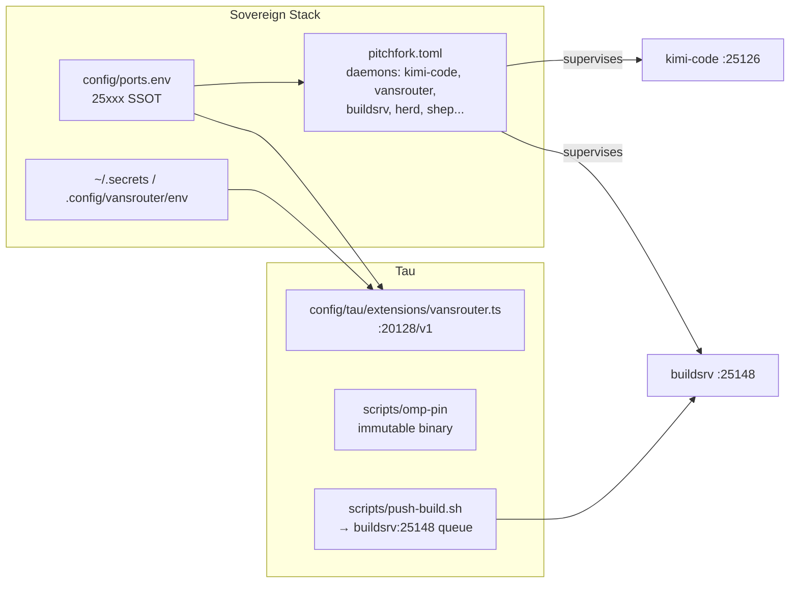

<p align="center">
  
</p>

<h1 align="center">tau</h1>
<p align="center">
  <strong>τ — the Sovereign Ranch runtime. A coding agent with the herd wired in.</strong><br/>
  <em>Fork of <a href="https://github.com/can1357/oh-my-pi">can1357/oh-my-pi</a> • v18.3.0 • 60+ providers • 31 tools • ~80k Rust</em>
</p>

<p align="center">
  <a href="https://www.npmjs.com/package/@oh-my-pi/pi-coding-agent"></a>
  
  
  
  
  
</p>

<p align="center">
  <code>~/sovereign/projects/range/ranch/stockyard/tau</code> • <code>forge/gate-r:main</code> • built by toxic @ awrawr-pc
</p>

---

### Sovereign / Ranch — What Makes Tau Tau

> Upstream gives you a coding agent. Tau gives you a **ranch** — immutable binaries, port SSOT, mesh-aware daemons, and source-owned model routing.

| Enhancement | File | Port | What it does |
| :--- | :--- | :---: | :--- |
| **VansRouter Integration** | `config/tau/extensions/vansrouter.ts` | `20128` | Source-owned OpenAI-compatible router. Canonical `.secrets` loading (`VANSROUTER_API_KEY` / `API_KEY_SECRET`), collapses `nvidia/nvidia/foo` → `nvidia/foo`, seed `oc/jev-1.13-free` + live `/models` sync on `session_start`. |
| **Kimi Code Daemon** | `pitchfork.toml` + `config/ports.env` | `25126` | Bundled `@moonshot-ai/kimi-code` via `bin/claim-port`. `[daemons.kimi-code]` run = `.../kimi-code/dist/main.mjs web --no-open --port 25126`. Supervised by Pitchfork, audited via `kimi-audit-dash:25116`. |
| **Immutable Binary Pinning** | `scripts/omp-pin` → `bin/omp-pin` | — | Hardened launcher. `git rev-parse --show-toplevel` → `packages/coding-agent/scripts/omp`, `realpath` check stays inside fork root, refuses to fall through to PATH. Prevents auto-update clobber. |
| **Mesh & Port SSOT** | `config/ports.env` | `25xxx` | Single source of truth. `LLAMA_SWAP=25100`, `KIMI_CODE=25126`, `VANSROUTER=20128`, `BUILDSRV=25148`, `QDRANT=25133`, etc. Zero hardcoded ports in code — extensions read `VANSROUTER_URL` / env. |
| **CI/CD Push-Building** | `scripts/push-build.sh` | `25148` | Git hook → buildsrv queue. Detects toolchain (bun/rust/go/python), extracts version from `packages/coding-agent/package.json`, writes `v18.3.0-<repo>-<sha>.json` to `$BUILDSRV_ROOT/queue`. |
| **Engine Migration Audit** | `docs/PRE_RELEASE_INTEGRATION_ENGINE.md` | — | Sovereign hotfix pattern: `hotfixRegistry.resolve(target, default)` + `patches/*.ts` persistent overrides + `fs.watch` live reload. No monkey patching. |


```mermaid
flowchart LR
    subgraph Sovereign Stack
        Ports[config/ports.env<br/>25xxx SSOT]
        Pitchfork[pitchfork.toml<br/>daemons: kimi-code, vansrouter,<br/>buildsrv, herd, shep...]
        Secrets[~/.secrets / .config/vansrouter/env]
    end
    subgraph Tau
        VRExt[config/tau/extensions/vansrouter.ts<br/>:20128/v1]
        OMPin[scripts/omp-pin<br/>immutable binary]
        PushBuild[scripts/push-build.sh<br/>→ buildsrv:25148 queue]
    end
    Ports --> VRExt
    Ports --> Pitchfork
    Secrets --> VRExt
    Pitchfork -->|supervises| KimiCode[kimi-code :25126]
    Pitchfork -->|supervises| BuildSrv[buildsrv :25148]
    PushBuild --> BuildSrv
```

---

## Install — Tau flavor

**From source (recommended for Ranch):**

```sh
git clone ~/sovereign/projects/range/ranch/stockyard/tau
cd tau
bun setup          # installs workspaces + builds @oh-my-pi/pi-natives
bun dev            # runs tau cli from source

# use the pinned launcher (never clobbers)
./bin/omp-pin --version
./scripts/push-build.sh   # queues v18.3.0 build to buildsrv:25148
```

**Bun global (upstream binary):**

```sh
bun install -g @oh-my-pi/pi-coding-agent
```

**Verify Sovereign integration:**

```sh
cat config/ports.env | grep -E "VANSROUTER|KIMI_CODE|BUILDSRV"
# VANSROUTER_PORT=20128
# KIMI_CODE_PORT=25126
# BUILDSRV_PORT=25148

cat pitchfork.toml | grep -A2 "\[daemons.kimi-code\]"
ls -lh config/tau/extensions/vansrouter.ts scripts/omp-pin scripts/push-build.sh
```

---

## The Pi you love, with ranch batteries

<details>
<summary><strong>01 · Code execution w/ tool-calling</strong></summary>

Persistent Python + Bun worker, loopback bridge to `read`, `grep`, `task`. Load CSV in Python, chart in JS, never leave the cell.
</details>

<details>
<summary><strong>02 · LSP wired into every write</strong></summary>

`workspace/willRenameFiles` — re-exports, barrels, aliased imports update before file moves.
</details>

<details>
<summary><strong>03 · Drives a real debugger</strong></summary>

lldb, dlv, debugpy — attach, step, inspect. Not print statements.
</details>

<details>
<summary><strong>04 · Time-traveling stream rules</strong></summary>

Regex aborts stream mid-token, injects rule, retries from same point. Survives compaction.
</details>

<details>
<summary><strong>05 · First-class subagents</strong></summary>

`task` fans out into isolated worktrees, typed results back. No prose parsing.
</details>

<details>
<summary><strong>06 · Advisor model</strong></summary>

Second model watches every turn, injects notes inline — quiet aside, concern, or hard blocker.
</details>

<details>
<summary><strong>07 · Collab links</strong></summary>

`/collab` → link + QR. `omp join` or browser. Read-write or view-only.
</details>

<details>
<summary><strong>08 · web_search 23 backends</strong></summary>

`perplexity`, `gemini`, `kimi`, `exa`, `tavily`, `firecrawl`, `brave`... Arxiv PDFs → structured markdown with anchors.
</details>

<details>
<summary><strong>09 · Unapologetically native</strong></summary>

`pi-shell` 38k LoC, `pi-natives` 25k LoC, `pi-walker` 5.2k — ripgrep, glob, jq in-process. No fork/exec on hot path. macOS/Linux/Windows.
</details>

---

## Providers & Models

**60+ providers, 1000 models, one `/model` away.**

Nine roles: `default`, `smol`, `slow`, `plan`, `commit`, `vision`, `task`, `advisor`, `tiny`. Override with `--smol`, `--slow`, `--plan`, cycle `Ctrl+P`.

**Frontier:** Anthropic `oauth` · OpenAI · OpenAI Codex `oauth` · Google Gemini · xAI · DeepSeek · Groq · Cerebras · Together · NVIDIA · etc.

**Coding plans:** Cursor `oauth` · Copilot `oauth` · Kimi Code `plan` · Moonshot · MiniMax `plan` · Qwen `oauth` · Z.AI `plan` · etc.

**Self-hosted:** Ollama `local` · LM Studio `local` · vLLM `local` · LiteLLM

**Custom (tau):** `vansrouter` provider

```yaml
# ~/.omp/agent/models.yml
providers:
  vansrouter:
    baseUrl: http://127.0.0.1:20128/v1
    api: openai-completions
    apiKey: ${VANSROUTER_API_KEY}
    models:
      - id: oc/jev-1.13-free
      - id: mmf/mimo-auto
```

---

## Monorepo Packages

| Package | Description |
| :--- | :--- |
| `@oh-my-pi/pi-ai` | Multi-provider LLM client, Kimi + VansRouter |
| `@oh-my-pi/pi-coding-agent` | Interactive CLI + SDK, Ranch extensions |
| `@oh-my-pi/pi-tui` | Terminal UI, differential rendering |
| `@oh-my-pi/pi-natives` | N-API bindings: grep, shell, image, etc. |
| `config/ports.env` | **Sovereign SSOT — 25xxx + 20128** |
| `config/tau/extensions/vansrouter.ts` | **Source-owned router integration** |
| `scripts/omp-pin` / `bin/omp-pin` | **Immutable binary pin** |
| `scripts/push-build.sh` | **CI/CD buildsrv:25148 queue** |
| `pitchfork.toml` | **Daemon supervision: kimi-code:25126, buildsrv, etc.** |

---

## Development

```sh
bun setup
bun dev -- --version

# checks
bun run check:ts
bun run lint

# ranch ops
./bin/omp-pin --help
./scripts/push-build.sh
cat config/ports.env
```

Debug: `/debug` — profiling, reporting.

See `packages/coding-agent/DEVELOPMENT.md`.

---

## License

MIT — upstream © 2025 Mario Zechner, © 2025-2026 Can Bölük, © 2026 Stencil Labs, Inc.

Tau fork © 2026 Sovereign Ranch — `projects/range/ranch/stockyard/tau` • v18.3.0 • `forge/gate-r:main`

_made for terminals that stay open on the ranch_

- [omp.sh](https://omp.sh)
- [Tau: ~/sovereign/projects/range/ranch/stockyard/tau](../../)
- [Sovereign: ~/sovereign/config/ports.env](../../config/ports.env)
