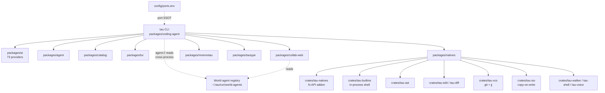

<div align="center">

# tau

**A coding agent that runs on your machine, in your processes, on your filesystem.**

[](crates/)
[](packages/)
[](packages/catalog/)
[](docs/tools/)
[](LICENSE)

</div>

---

**tau** is a terminal coding agent built for people who care what their agent
actually *does*. Not a chat wrapper around a hosted model — a real binary that
shells out, reads, edits, runs, and builds on the machine you already have.

Most agents fork `/usr/bin/grep` for every search. tau ships its own Rust
implementations and calls them **in-process**: 59 shell builtins, a BPE tokenizer
with 6 tokenizer families, git and jj drivers, copy-on-write file operations, and
a full AST editing layer — none of which spawn a subprocess.

It also knows what other agents are doing. Every session publishes its agent tree
to a **machine-wide registry**, so a second `tau` in another window can discover
this one and read its output through `agent://`.

```sh
bun setup      # install workspaces + build the native addon
bun dev        # run tau from source
```

Full install, config, and architecture: [below](#table-of-contents).

---

## Table of contents

- [Features](#features)
- [Architecture](#architecture)
- [Quick start](#quick-start)
- [Machine-wide agent registry](#machine-wide-agent-registry)
- [Native addon](#native-addon)
- [Config & optional services](#config--optional-services)
- [Packages](#packages)
- [Extensions & skills](#extensions--skills)
- [Known gaps](#known-gaps)
- [Dev & contributing](#dev--contributing)
- [License & security](#license--security)

---

## Features

- **CLI + SDK** — `packages/coding-agent` ships the `tau` binary (`src/cli.ts`)
  and a programmatic SDK: read, bash, edit, write, grep, glob, task, and session
  management.
- **73 models across 73 providers** — `packages/catalog` is the provider census;
  `packages/ai` carries **69 provider wire implementations**. Role-based routing:
  `smol`, `slow`, `plan`, `vision`, `task`, `advisor`, `tiny`. CLI flags `--smol`,
  `--slow`, `--plan`.
- **In-process shell, no fork/exec** — `crates/tau-builtins` provides 59 shell
  builtins (`grep`, `sed`, `cat`, `find`, `fd`, `rg`, `head`, `tail`, `tee`, `cut`,
  `wc`, `xargs`, `date`, `sort`, `uniq`, …) plus 8 process-control builtins
  (`pgrep`, `pkill`, `pidwait`, `ps`, `top`, `sleep`, `timeout`, `nohup`) and 59
  utility commands, running **inside** the agent process.
- **Native AST editing** — `tau-ast` parses source for structural edits;
  `tau-edit`/`tau-diff` apply them surgically. Backed by the `ast-grep` and
  `ast-edit` tools.
- **Git and jj, native** — `crates/tau-vcs` drives both VCSes for diff, mutate,
  patch, and read operations.
- **Copy-on-write file ops** — `crates/tau-iso` speaks APFS clones, Linux reflinks,
  Btrfs, ZFS, overlayfs, and Windows block cloning (`apfs.rs`, `linux_reflink.rs`,
  `btrfs.rs`, `zfs.rs`, `overlayfs.rs`, `windows_block_clone.rs`).
- **Machine-wide agent registry** — every interactive session publishes its agent
  tree over a private Unix socket, so other `tau` processes on the box can
  **discover** and **read** it via `agent://` and `history://`. Not a monkey
  patch, not a central broker. See
  [Machine-wide agent registry](#machine-wide-agent-registry).
- **First-class subagents** — `task` fans out into isolated worktrees with typed
  results returned to the parent (`packages/agent`).
- **Memory engine** — `packages/mnemotau`: local SQLite memory for agents.
- **33 documented tools** — one doc per tool in `docs/tools/`: `bash`, `read`,
  `write`, `edit`, `grep`, `glob`, `find`, `task`, `lsp`, `debug`, `browser`,
  `computer`, `web_search`, `github`, `tts`, `memory_edit`, `checkpoint`, `rewind`,
  `ask`, `learn`, `eval`, `ast-grep`, `ast-edit`, `security_scan`, `todo`, and
  more.
- **Live session collaboration** — `packages/collab-web` exposes `/collab` with a
  link and QR code; join via `tau join` or a browser, read-write or view-only.
- **Browser relay** — `packages/browser-relay` lets the browser tool drive your
  **existing** Chrome tabs via a Chrome extension.
- **Type-safe runtime schemas** — `packages/tautype`: ArkType-compatible runtime
  validation with lazy JIT compilation.
- **Snapcompact** — bitmap-frame context compression for vision-capable LLMs.
- **Observability & benchmarks** — `packages/stats` (local usage dashboard),
  `packages/metaharness` (benchmark runners, REST/SSE APIs, live dashboard).
- **Immutable binary pinning** — `bin/tau-pin` resolves the fork root via
  `git rev-parse --show-toplevel`, `realpath`-checks containment, and refuses to
  fall through to PATH. Auto-update cannot clobber it.
- **Port SSOT** — `config/ports.env` is the single source of truth for every
  service port. Zero hardcoded ports in code.
- **Daemon supervision** — `pitchfork.toml` tracks `tau`, `mesh-hub`,
  `kimi-code`, `vansrouter`, `kimi-auto-shim`, and `buildsrv`.
- **Upstream sync without merge anxiety** — `scripts/upstream-pull.ts` performs an
  ancestry-free entity merge across unrelated git histories (see
  [UPSTREAM-MERGE.md](docs/UPSTREAM-MERGE.md)).

---

## Architecture


```mermaid
graph TD
  A["tau CLI<br/>packages/coding-agent"] --> B["packages/ai<br/>73 providers"]
  A --> C["packages/agent"]
  A --> D["packages/catalog"]
  A --> E["packages/tui"]
  A --> F["packages/collab-web"]
  A --> G["packages/mnemotau"]
  A --> H["packages/tautype"]
  A --> I["packages/natives"]

  I --> J["crates/tau-natives<br/>N-API addon"]
  I --> K["crates/tau-builtins<br/>in-process shell"]
  I --> L["crates/tau-ast"]
  I --> M["crates/tau-edit / tau-diff"]
  I --> N["crates/tau-vcs<br/>git + jj"]
  I --> O["crates/tau-iso<br/>copy-on-write"]
  I --> P["crates/tau-walker / tau-shell / tau-voice"]

  A -.->|"agent:// reads<br/>cross-process"| Q["World agent registry<br/>~/.tau/run/world-agents"]
  F -.->|"reads"| Q
  R["config/ports.env"] -.->|"port SSOT"| A
```

---

## Quick start

```sh
bun setup                 # install workspaces + build @tau/tau-natives
bun dev                   # run the tau CLI from source
./bin/tau-pin --version   # pinned launcher — never clobbered by auto-update
```

Prefer the upstream binary untouched? `bun install -g @tau/tau-coding-agent` — but
you lose the ranch layer (pinned launcher, port SSOT, extensions).

---

## Machine-wide agent registry

`AgentRegistry` is **process-global**: one main agent plus its subagents, per OS
process. That makes `agent://` and `history://` invisible to a second `tau` on the
same machine. Registry 0x01 fixes that as a first-class feature.

Each interactive session publishes its agent tree — ids, kinds, statuses, session
files — to `~/.tau/run/world-agents`. Publication reuses the proven collab host
machinery: a private Unix socket, newline-delimited JSON, a per-publication bearer
token, and `sun_path` relocation for deep config roots. Discovery is a directory
scan; there is no central broker and nothing to reconnect to.

Consequences:

- **`agent://<id>` reads across processes.** A peer's artifacts live beside its
  own transcript, so its directory joins the scan — but *after* local directories,
  because a same-process agent is the one your session actually spawned.
- **A cross-process miss names the peer** (pid + cwd) instead of failing dead.
- **A dead process is pruned** by a pid-liveness probe, so the roster self-heals.
- **Publication failure never blocks startup.** If the endpoint can't be created,
  the bridge logs and degrades to in-process behavior.

Writes stay local to the process's own registry on purpose — cross-process
delivery needs a durable queue and exactly-once semantics that fire-and-forget
mailbox semantics don't provide, and faking it would fail worse than erroring.

`crates`/modules: `registry/world-registry-daemon.ts` (transport),
`registry/world-registry-bridge.ts` (session glue). Tests in
`test/world-registry.test.ts` cover the real cross-process case.

---

## Native addon

`crates/tau-natives` is an N-API addon providing the BPE tokenizer (six tokenizer
families, linkable per-family), the shell runtime, and the file/VCS primitives.

**Tokenizer families** are compile-time features — every family is linked by
default (~5 MB of compressed vocabulary); opt out per family to slim a binary that
only serves one model, the same trade `rust-tiktoken` makes.

**Wayland screencast** is gated behind `--features wayland-pipewire`. It's off by
default because the pipewire crate hard-links system `libpipewire-0.3` via
pkg-config, which no CI/cross triple (musl, arm64) can satisfy. Without the
feature, Wayland capture calls fail at runtime with *"Wayland capture requires the
wayland-pipewire feature"*. Linux devs who want screencast opt in explicitly:

```sh
cargo build -p tau-natives --release --features wayland-pipewire
bun --cwd=packages/natives run gen:native      # embed into dist
bun --cwd=packages/coding-agent run build
```

**Important:** `dist/tau` embeds the addon and re-extracts it to
`~/.tau/natives/<version>/` on every launch, so patching that directory never
sticks. The supported path is a cargo build → `gen:native` → rebuild above.

---

## Config & optional services

| Service | Port | What it does |
|---|---|---|
| `LLAMA_SWAP` | 25100 | local model server |
| `KIMI_CODE` | 25126 | Kimi code backend |
| `VANSROUTER` | 20128 | source-owned OpenAI-compatible router |
| `FLOCK` | 25193 | Flock gateway |
| `BUILDSRV` | 25148 | build server / remote task cache |
| `QDRANT` | 25133 | vector store (gRPC 25134) |

Every port is defined once in `config/ports.env` and consumed from there —
nothing hardcodes a port in code. Ports are pulled by services via
`stack/lib-ports.sh` / `require_port`, and pitchfork daemons carry their port in
the `[daemons.*]` tables.

`packages/coding-agent` also ships `config/tau/extensions/vansrouter.ts` — a
source-owned OpenAI-compatible router on `:20128` with canonical `.secrets`
loading and provider-path collapsing (`nvidia/nvidia/foo` → `nvidia/foo`).

---

## Packages

| Package | What it is |
|---|---|
| `agent` | agent loop, subagent orchestration |
| `ai` | 73 providers, auth, streaming, hedging/retry |
| `browser-relay` | Chrome-extension relay so the browser tool drives real tabs |
| `catalog` | provider/model census and compatibility rules |
| `coding-agent` | the `tau` binary + SDK |
| `collab-web` | collab guest UI + local relay |
| `metaharness` | benchmark runners, REST/SSE APIs, live dashboard |
| `mnemotau` | local SQLite memory engine |
| `natives` | N-API addon build/embed pipeline |
| `snapcompact` | bitmap-frame context compression for vision models |
| `stats` | local observability dashboard |
| `tautype` | ArkType-compatible runtime validation (lazy JIT) |
| `tui` | terminal UI framework |
| `utils` | shared utilities, config-dir resolution |
| `wire` | shared wire-protocol types |
| `typescript-edit-benchmark` | edit-application benchmark suite |

---

## Extensions & skills

**Extensions** live in `ranch/tau-extensions/packages/`:

| Extension | What it does |
|---|---|
| `omp-edit-committer` | auto-commits every Edit/Write with intent + trade-off messages |
| `omp-kafka` | consumes Kafka topics into a session (push/pull) |
| `omp-model-router` | complexity-based routing across cheap/mid/expensive models |
| `rawhide` | slop-free prose linter and style engine |
| `tau-kimi-auto` | virtual `kimi-auto` model resolving to the best Kimi |
| `tau-omniroute` / `pi-omniroute-sync` | OmniRoute model sync for tau/pi/omp |
| `tau-loops` | reusable audit loops for the sovereign stack |

---

## Known gaps

`docs/MISSING-FEATURES.md` records every source-verified finding from the
2026-10-08 audit — features documented but never implemented (hedged streaming,
the hotfix registry, the `tack` provider generator) and features intended but
unbuilt. Each entry cites the command that proves the gap.

---

## Dev & contributing

```sh
bun setup
bun dev -- --version

# checks
bun run check:ts
bun run lint

# tests (TS + Rust + Python)
bun run test
```

---

## License & security

```
Copyright © 2025 Mario Zechner (upstream oh-my-pi / tau)
SPDX-License-Identifier: MIT
```

`LICENSE` · [`CONTRIBUTING.md`](CONTRIBUTING.md) ·
[`THIRD-PARTY-NOTICES.txt`](THIRD-PARTY-NOTICES.txt)

Reporting a vulnerability: open a private security advisory on the repository
rather than a public issue.

---

## Provenance

tau is a sovereign fork of [oh-my-pi](https://github.com/can1357/oh-my-pi),
tracking upstream `v18.3.0` with an ongoing upstream sync. The fork's own deltas
— extensions, port SSOT, agents, skills, the ranch layer — are catalogued in
`FORK_MANIFEST.tsv`. See [UPSTREAM-MERGE.md](docs/UPSTREAM-MERGE.md) for the merge
workflow and [`MIRROR-DIFF-vs-upstream.md`](MIRROR-DIFF-vs-upstream.md) for the
delta census.

---

<div align="center">
<sub>Built on the ranch · sovereign fork of oh-my-pi</sub>
</div>